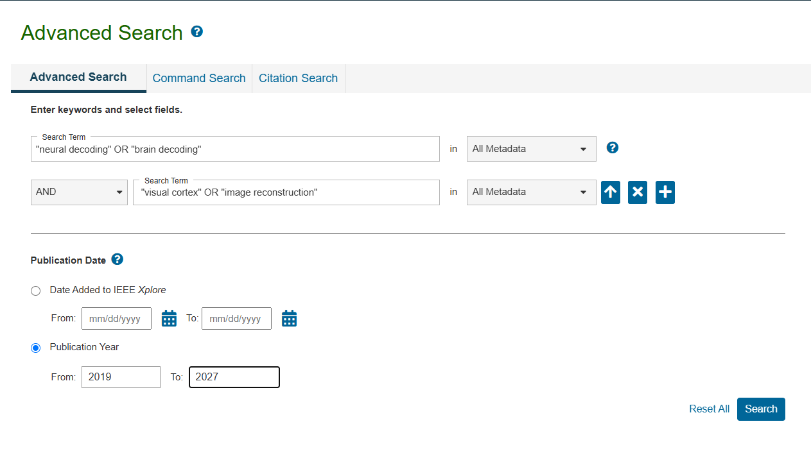

# neuraldecoding.github.io
Neural Decoding Research

## SLR


```txt
( 
  ( TITLE-ABS-KEY ( "neural decoding" ) OR 
    TITLE-ABS-KEY ( "brain decoding" ) OR
    TITLE-ABS-KEY ( "neural reconstruction" ) OR
    TITLE-ABS-KEY ( "brain-to-image" ) )
  AND 
  ( TITLE-ABS-KEY ( "visual cortex" ) OR 
    TITLE-ABS-KEY ( "visual system" ) OR
    TITLE-ABS-KEY ( "visual perception" ) OR
    TITLE-ABS-KEY ( v1 OR v2 OR v4 ) )
  AND 
  ( TITLE-ABS-KEY ( "image reconstruction" ) OR
    TITLE-ABS-KEY ( "visual reconstruction" ) OR
    TITLE-ABS-KEY ( "image generation" ) OR
    TITLE-ABS-KEY ( "visual decoding" ) )
) 
AND PUBYEAR > 2019 AND PUBYEAR < 2027
```

28 Document


### Scopus database

```txt
( 
  ( TITLE-ABS-KEY ( "neural decoding" ) OR TITLE-ABS-KEY ( "brain decoding" ) ) 
  AND 
  ( TITLE-ABS-KEY ( "visual cortex" ) OR TITLE-ABS-KEY ( "image reconstruction" ) )
) 
AND PUBYEAR > 2019 AND PUBYEAR < 2027
```


```url
https://www.scopus.com/results/results.uri?sort=plf-f&src=s&sid=e0fb38e56ceb4ccc9b9cb87a68a7e449&sot=a&sdt=a&sl=211&s=%28+%28+TITLE-ABS-KEY+%28+%22neural+decoding%22+%29+OR+TITLE-ABS-KEY+%28+%22brain+decoding%22+%29+%29+AND+%28+TITLE-ABS-KEY+%28+%22visual+cortex%22+%29+OR+TITLE-ABS-KEY+%28+%22image+reconstruction%22+%29+%29+%29+AND+PUBYEAR+%26gt%3B+2019+AND+PUBYEAR+%26lt%3B+2027&origin=searchadvanced&editSaveSearch=&txGid=aa3784a413bf1d310e2527d64bcd7eac&sessionSearchId=e0fb38e56ceb4ccc9b9cb87a68a7e449&limit=200
```

Hasilnya:
* Article 55
* Conference Paper 29
* Review 4

88 document

dan

50 preprints

### IEEE Database



query
```txt
"neural decoding" OR "brain decoding"

AND

 "visual cortex" OR "image reconstruction"


Publication Year
2019 to 2026
```

```url
https://ieeexplore.ieee.org/search/searchresult.jsp?action=search&newsearch=true&matchBoolean=true&queryText=(%22All%20Metadata%22:%22neural%20decoding%22%20OR%20%22All%20Metadata%22:%22brain%20decoding%22)%20AND%20(%22All%20Metadata%22:%22visual%20cortex%22%20OR%20%22All%20Metadata%22:%22image%20reconstruction%22)&ranges=2019_2026_Year
```

Hasilnya 52 document:

* Conference 26
* Journals 22
* Early Access Articles 4

### Estimasi Workflow

```txt
~140 dokumen (Scopus + IEEE sebelum deduplikasi)
    ↓
~100-120 dokumen (Setelah hapus duplikat)
    ↓
~70-80 dokumen (Setelah screening title/abstract)
    ↓
~40-50 dokumen (Setelah full-text review)
    ↓
~30-40 dokumen (FINAL untuk analisis)
```

Langkah: 
1. Export dari Scopus → format RIS/BibTeX
2. Export dari IEEE → format RIS/BibTeX  
3. Import semua ke Mendeley/Zotero
4. Jalankan "Check for Duplicates"
5. Review manual untuk duplikat yang terlewat

Deduplicate otomatis
```url
https://colab.research.google.com/drive/1dK1OTfULLtE1d9Gd-a5iWjef9h8PjUD2?usp=sharing
```

### Prisma Flowchart

```txt
┌─────────────────────────────────────┐
│   Records identified through        │
│   database searching (n = 140)      │
│   - Scopus: 88                      │
│   - IEEE: 52                        │
└──────────────┬──────────────────────┘
               ↓
┌─────────────────────────────────────┐
│   Records after duplicates          │
│   removed (n = ~110)                │
└──────────────┬──────────────────────┘
               ↓
┌─────────────────────────────────────┐
│   Records screened                  │
│   (title/abstract) (n = ~110)       │
└──────────────┬──────────────────────┘
               ↓
        (dan seterusnya...)

```

### Inclusion Criteria

* IC1. Peer-reviewed journal articles and conference papers
* IC2. Published between 2020-2026
* IC3. Focus on neural/brain decoding for visual information
* IC4. Involves visual cortex or image reconstruction
* IC5. Written in English
* IC6. Full-text available

### Exclusion Criteria

* EC1. Non-peer-reviewed (preprints, technical reports)
* EC2. Review articles, editorials, book chapters
* EC3. Not related to visual decoding/reconstruction
* EC4. Animal studies only (if your focus is human)
* EC5. Duplicate publications
* EC6. Full-text not accessible