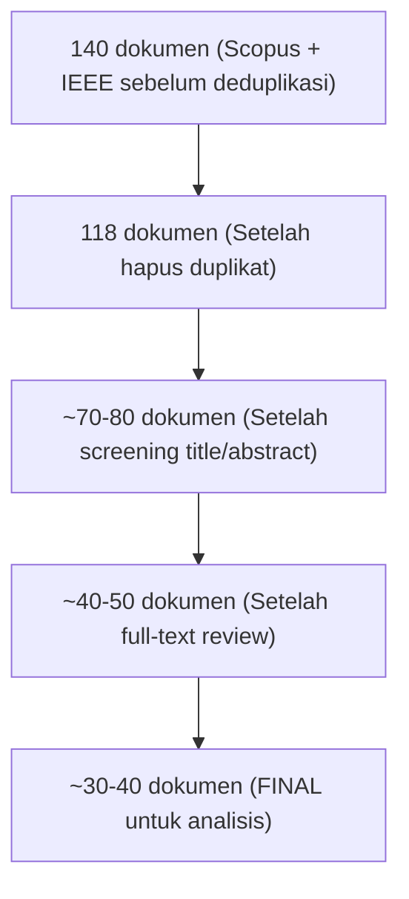

# Neural Decoding Research

Research fokus on Visual Neural Decoding Research

Team:
* Rolly Maulana Awangga -- rollymaulanaa@student.telkomuniversity.ac.id
* Prof. Dr. SUYANTO S.T., M.Sc. -- suyanto@telkomuniversity.ac.id
* Bedy Purnama, S.Si., M.T., Ph.D. -- bedypurnama@telkomuniversity.ac.id

Links:
1. [Systematic Mapping Study](/sms)


## Executive Summary

Systematic Mapping Study

### Hasil Workflow



Langkah: 
1. Export dari Scopus → [format BibTeX](/sms/bibtex/scopus.bib)
2. Export dari IEEE → [format BibTeX](/sms/bibtex/ieee.bib)  
3. Upload ke [tools bibtex cleaner and validation](https://colab.research.google.com/drive/1dK1OTfULLtE1d9Gd-a5iWjef9h8PjUD2?usp=sharing) untuk dua file tersebut
4. Jalankan [tools](https://colab.research.google.com/drive/1dK1OTfULLtE1d9Gd-a5iWjef9h8PjUD2?usp=sharing) hingga hasil akhir deduplikasi sudah di dapatkan
5. Review manual untuk duplikat yang terlewat

Tools validasi dan deduplikasi referensi
```url
https://colab.research.google.com/drive/1dK1OTfULLtE1d9Gd-a5iWjef9h8PjUD2?usp=sharing
```

### Prisma Flowchart

```txt
┌─────────────────────────────────────┐
│   Records identified through        │
│   database searching (n = 140)      │
│   - Scopus: 88                      │
│   - IEEE: 52                        │
└──────────────┬──────────────────────┘
               ↓
┌─────────────────────────────────────┐
│   Records after deduplicates        │
│   removed (n = 118)                 │
└──────────────┬──────────────────────┘
               ↓
┌─────────────────────────────────────┐
│   Records screened                  │
│   (title/abstract) (n = ~110)       │
└──────────────┬──────────────────────┘
               ↓
        (dan seterusnya...)

```

